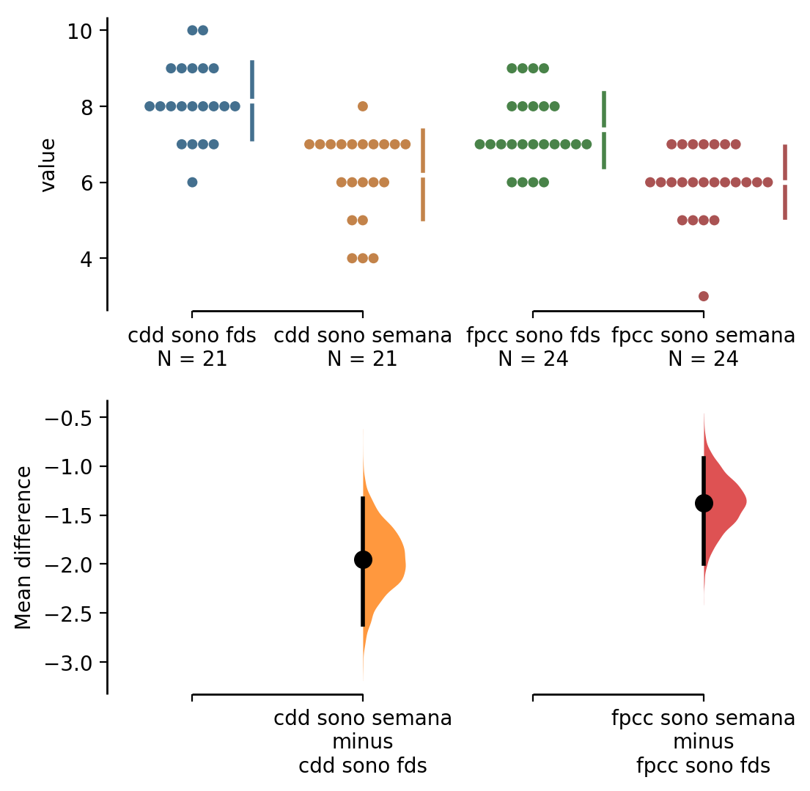

### Importando dos dados
```{r}
dados = read_csv(here::here("data/amostra-alunos-comfpcc.csv"))

dados = dados %>%
    rename(
        sono_semana = `Quantas horas por noite você dorme DURANTE A SEMANA em média?`,
        sono_fds = `Quantas horas por noite você dorme durante NO FIM DE SEMANA em média?`,
        disciplinas = `Quantas disciplinas você está cursando esse semestre?`,
        cafe = `Quantas xícaras de café você tomou ontem?`,
        segue_gh = `Quantas pessoas você segue no github?`,
        seguido_gh = `Quantas pessoas seguem você no github?`,
        quase_concluinte = `Você está dois períodos ou menos de concluir?`
    )

dados = dados %>% 
    mutate(data = lubridate::mdy_hms(Timestamp),
           turma = if_else(data < as.POSIXct("2019-05-24 12:00:00"), 
                           "cdd", 
                           "fpcc"))%>% 
    filter(segue_gh < 800, 
           disciplinas < 10,
           seguido_gh < 900)

```

## 1. Qual o impacto do curso no sono dos alunos de graduação e de pós graduação, comparando quanto eles dormem durante a semana e nos fins de semana?

```{r}

dados %>%
    summarise(media_sono_semana = mean(sono_semana),
              media_sono_fds = mean(sono_fds))

```

```{r}
dados %>%
    mutate(diferenca = sono_semana - sono_fds) %>%
    summarise(media_diferenca = mean(diferenca))
```
Definindo o impacto do curso no sono dos alunos como a diferença entre o tempo dormido durante a semana e o tempo dormido no final de semana, podemos observar que o curso pode ter um impacto negativo no sono dos alunos. Os alunos dormem menos durante a semana, que é geralmente o momento de maior frequência das atividades do curso, do que no final de semana.


## 2. O impacto é maior para um dos cursos?



A partir do método utilizado, onde aplicamos 95% de confiança, é possível afirmar que para a turma de CDD a diferença média é de -1.95 e esse valor pode variar entre -2.62 e -1.33 para a população que a turma de CDD representa. 
Já para a turma de FPCC a diferenã média é de -1.38 e pode variar entre -2.0 e -0.917. (A partir dos sumário gerado na ferramenta www.estimationstats.com)

O sinal negativo indica que o valor dormido na semana é menor do que o valor dormido no final semana, para ambos o casos.
Já falando especificamente do valor de -1.95, ele significa que existe uma distância maior entre o tempo dormido na semana e no final de semana para os alunos da graduação, quando comparado com o valor de -1.38 da turma da pós graduação. O que nos permite afirmar que o impacto é maior para a turma de CDD.

O impacto não necessariamente indica que um grupo dorme mais do que outro, mas sim a diferença entre as horas de sono durante a semana e as horas de sono durante final de semana. O que pode representar que as atividades do curso durante a semana tem um peso maior nas horas de sono dos alunos ou que um curso influencia tanto durante a semana quanto no final de semana, e por conta disso exista uma diferença pequena entre as horas de sono. Seria preciso uma outra análise capaz de detalhar os fatores que inlfluenciam nessa diferença.

Inclusive olhando a média de tempo dormido entre os grupos podemos ver que a turma de CDD dorme mais do que a turma de FPCC. Os dois grupos têm valores muito próximos olhando o tempo dormido durante a semana, porém, no final de semana o grupo de CDD dorme quase 1 hora a mais do que o grupo de FPCC.

```{r}

dados %>%
    group_by(turma) %>%
    summarise(media_semana = mean(sono_semana),
              media_fds = mean(sono_fds),
              total = media_semana + media_fds)

```
